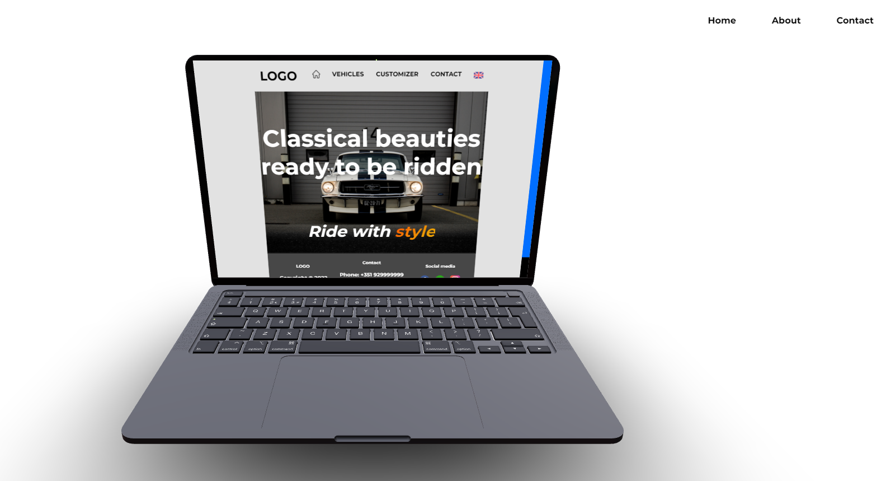

# r3f-electronics-store
In this project, we created a simple website that combines a 3D model as a teaser with regular HTML content.

The model itself is a laptop that when we scroll down it opens and displays the HTML content from a previous dummy website. We can even click and select content from it.

A small easter egg is hidden in the navigation bar links. Look for it!

Feel free to use and adapt this project to your needs.
Don't forget to support my work and mention it.

